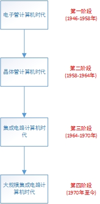
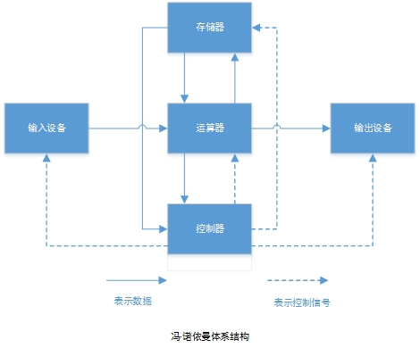
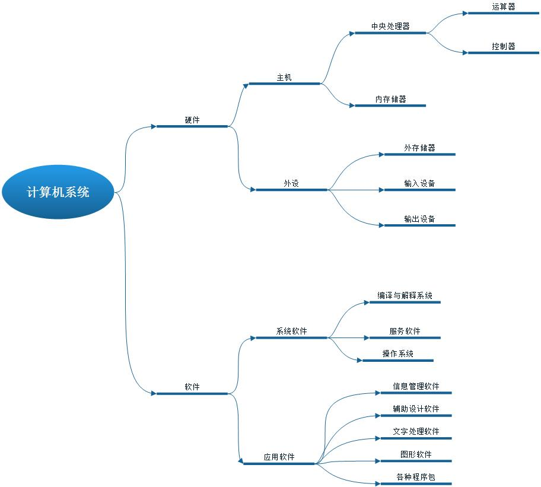
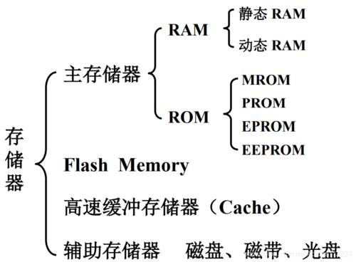
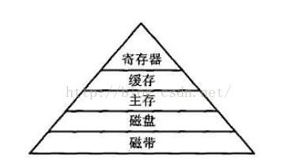
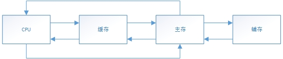
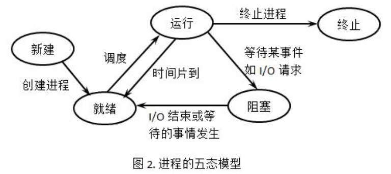

# 第一章 计算机系统

## 1.1 概述
### 1.1.1 计算机发展历程

### 1.1.2 计算机体系结构

### 1.1.3计算机系统组成

## 1.2 计算机硬件系统
1. 中央处理器
2. 存储器
3. 输入设备
4. 输出设备

### 1.2.1 中央处理器
>　中央处理器简称处理器，也叫CPU (central processing unit)

> `cpu的构成：CPU主要由运算器、控制器、寄存器组和内部总线构成。`

* 控制器
* 运算器
* 寄存器
* 总线

### 1.2.2 计算机的基本工作原理

一条计算机指令由==操作码==和==操作数(地址码)==组成

### 1.2.3 存储器

### 1.2.4 数据的内部表示

> 根据符号位，和数值位的编码方式不同，机器数有原码、补码、反码三种表示。

定点数的表示和运算：
* 原码：机器数最高位为符号位，0表示正数，1表示复数，数值跟随其后，并以绝对值的的形式给出
* 反码：==正数的反码和原码相同==；负数的补码是对该数的原码符号位外各位取反；
* 补码：正数的补码和原码相同；负数的补码是该数的反码的最后（即最右边）一位加 1。
* 偏移码： 不管正数还是负数，其==补码的符号位取反==既是偏移码

浮点数的表示和运算：
1. 浮点数的表示范围
N = M * R^E
    * N： 浮点数
    * M： 尾数
    * E： 阶码
    * R： 阶的基数（底）

2. IEEE 754 标准
    * 单精度浮点（32位），阶码8位，尾数24位（内含 1 位符号位）
    * 双精度浮点（64位），阶码11位，尾数53位（内含 1 位符号位）

### 1.2.5 总线和外设
1. 总线
    * 片内总线
    * 系统总线
    * 通信总线
2. 输入/输出系统
    * I/O 方式：
        1. 程序查询方式
        2. 程序中断方式
        3. DMA方式
        4. 通道方式

## 1.3 操作系统
操作系统是直接与硬件层相邻的第一层软件，他对硬件进行首次扩充，是其他软件运行的基础。
### 1.3.1 操作系统概述
1. 操作系统的功能与任务
    * 处理机管理
    * 存储器管理
    * 设备管理
    * 文件管理
    * 用户接口

2. 操作系统的发展过程
    * 手工操作（无操作系统）
    * 批处理系统
    * 多道程序系统
    * 分时系统
    * 个人计算机操作系统

3. 操作系统的分类
    1. 多道批处理操作系统
    2. 分时操作系统
    3. 实时操作系统
    4. 网络操作系统
    5. 分布式操系统
    6. 嵌入式操作系统

### 1.3.2 进程管理
> 进程(process)，是指一个具有一定独立功能的程序关于某个数据集合和一次运行活动。

进程的状态及其转化
1. 运行状态
2. 就绪状态
3. 等待状态
4. 创建状态
5. 中止状态

进程控制块及其组织
1. 进程控制块 PCB (process control block)

> 系统为每个进程分别建立进程控制块，用以记录对应进程的程序和数据的存储情况，记录进程的动态信息

2. 进程的组织
    1. 线型表组织
    2. 链接表组织

3. 进程调度(process scheduling)
    1. 先来先服务调度算法(first-come first served,FCFS)
    2. 时间片轮转调度算法(round-robin algorithm,RR)
    3. 优先级调度算法(priority-scheduling algorithm)
        * 抢占式(preemptive)
        * 非抢占式(non-preemptive)

### 1.3.3 存储管理
 1. 存储管理的功能和地址重定位
    * ==存储管理的功能==
        1. `地址变换`：把用户程序中相对地址转换成实际内存空间的绝对地址
        2. `内存分配`： 按照空间大小、策略划分内存，以便分配给各个程序使用
        3. `存储共享与保护`： 由于用户程序与操作系统同在内存，因此，既要让用户共享系统的程序和数据，也不能相互干扰破坏
        4. `存储器扩充`：将需要的程序和数据放在内存，其余数据暂时放在外存，等需要时在调入内存。
    * ==地址重定位==：将逻辑地址转化为内存空间的实际地址（物理地址）称为地址变换（地址映射），在进行地址变换是，必须修改程序中所有地址有关的项，这个调整过程称为地址重定位。

2. ==连续存储管理==：也称界地址存储管理。内存被划分为一个个分区，一个作业占一个分区，即系统和用户作业都以分区为单位享用内存。
    * 固定分区：易产生内部碎片
    * 可变式分区：易产生外部碎片

3. ==分页式存储管理==： 作业空间划分为页，实际内存空间划分为块，其中页与块大小相等，建立起对应管理，借助动态地址重定位技术，可在分散不连续的物理存储块中运行作业，在`内存空间管理上有优势`。

4. ==分段式存储管理==：将作业地址空间划分若干逻辑段，每段必须分配连续空间，但各段不要求连续，各段长度不相同，在`地址空间的管理上有优势`。

5. ==段页式存储管理==:分页和分段方式的结合，同时具备两者的优点。

6. ==虚拟存储管理==
    1. 请求页式存储管理：程序页在需要时从外存装入内存
    2. 请求段式存储管理
    3. 请求段页式存储管理

### 1.3.4 文件管理

1. 文件和文件系统
    1. 文件：
    `指一组带有标识（文件名）的、逻辑上有完整意义的信息项序列。`
    2. 文件系统：
    `文件系统(file system)，是指负责存取和管理文件信息的软件机构。`
        * EXT2/4：linux常用文件系统
        * NFS：网络文件系统
        * HPFS：高性能文件系统
        * FAT： FAT12、16、32
        * NTFS：微软为了配合Windows NT的推出而设计文件系统

2. 文件的组织结构
    * 文件的逻辑结构
    * 文件的物理结构

3. 文件目录管理：`建立文件与外存中的物理地址对应，这种对关系的数据结构称为文件目录。每个文件的文件目录又称为文件控制块(file control block,FCB)`

4. 文件空闲区的组织

### 1.3.5 I/O设备管理

1. 输入/输出的软件层次结构：略
2. 中断处理过程：略
3. 设备驱动程序：驱动物理设备和DMA控制器或I/O控制等直接进行I/O操作的子程序集合。
4. 与设备无关的I/O软件：向用户层提供一个统一的接口
5. 用户层的I/O软件:面向程序员，负责用户与设备无关的I/O通信
6. 设备的回收与分配