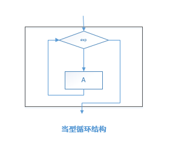

# 第三章 程序设计基础

## 3.1 程序设计方法与风格

程序设计风格指==编写程序时所表现出的特点、习惯和逻辑思路==，良好的程序设计风格可以使程序结构清晰合理，使程序代码便于维护，当今主导的程序设计风格：==“清晰第一，效率第二”==。

形成良好的程序设计风格，主要应注重考虑以下因素：

1. 源程序文档化
2. 数据说明的方法
3. 语句的结构
4. 输入和输出

> 内聚：每个模块尽可能独立完成自己的功能，不依赖于模块外部的代码。
> 耦合：模块与模块之间接口的复杂程度，模块之间联系越复杂耦合度越高，牵一发而动全身。

##　3.2 结构化程序设计

结构化程序设计方法的四条原则：

1. 自顶向下；
2. 逐步求精；
3. 模块化；
4. 限制使用goto语句;

结构化程序的基本结构：

1. 顺序结构

   

2. 选择结构

   

3. 循环结构

   1. 当型循环结构：先判断后执行循环体;
   2. 直到循环结构：先执行循环体后判断;

   

   

## 3.3 面向对象的程序设计

**面向对象**的设计方法与传统的的面向过程的方法有本质不同，它的**基本原理是，使用现实世界的概念抽象地思考问题从而自然地解决问题。**它强调模拟现实世界中的概念而不强调算法，它鼓励开发者在软件开发的绝大部分中都用应用领域的概念去思考。

面向对象方法的基本概念：

1. 对象(object)

   1. 对象的基本特点：
      （1）标识惟一性；
      （2）分类性；
      （3）多态性；
      （4）封装性；
      （5）模块独立性好。

2. 类(class)和实例(instance)

   1. 类：具有共同属性、共同方法的对象的集合；是“对象”的抽象，描述了该对象类型的所有对象的性质。
   2. 实例：其对应类的一个对象。

3. 消息(massage)

   是一个实例与另一个实例之间传递的信息。对象间的通信靠==消息==传递。它请求对象执行某一处理或回答某一要求的信息，它统一了数据流和控制流。

   消息的**组成**包括：
   （1）接收消息的对象的名称；
   （2）消息标识符，也称消息名；
   （3）零个或多个参数。

4. 继承(inheritance)

   使用已有的类定义作为基础建立新类的定义技术。

5. 多态性(polymorphism)

   是指同样的消息被不同的对象接受时可导致完全不同的行动的现象。