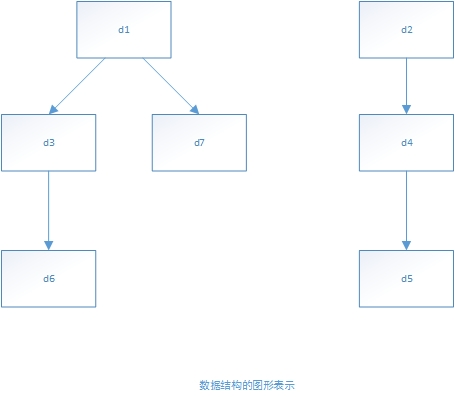
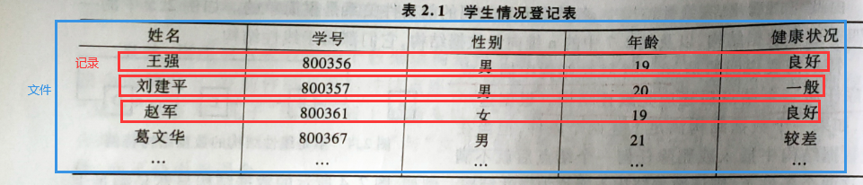
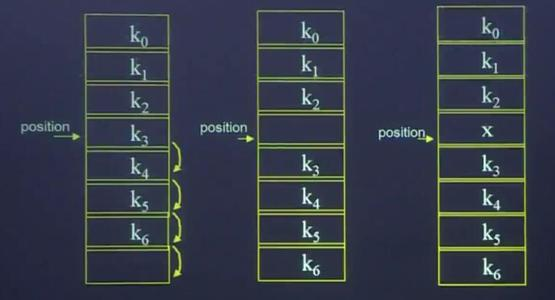
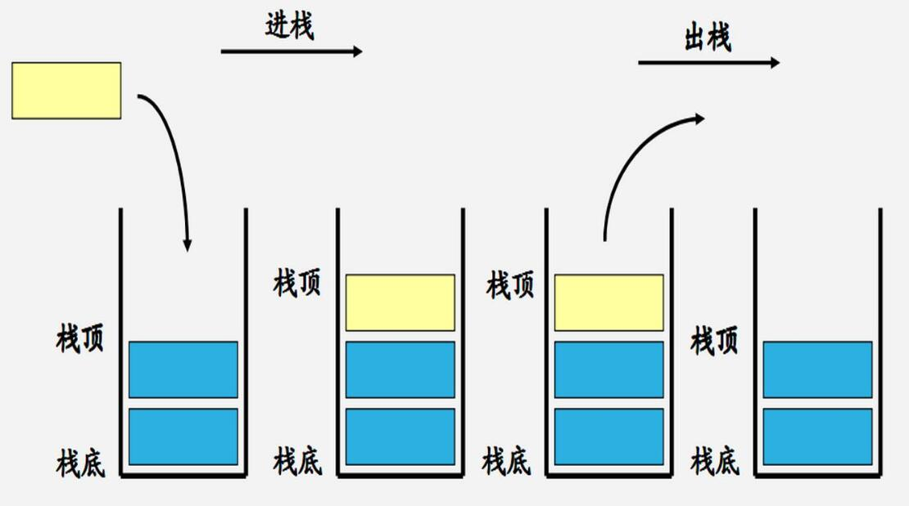
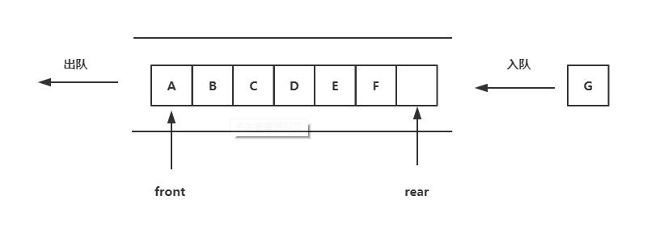
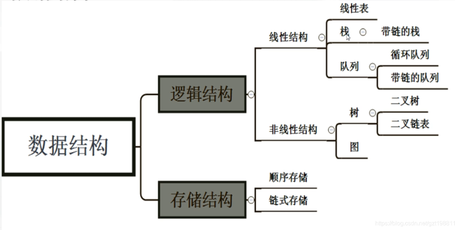

# 第二章 数据结构与算法

# 2.1 算法

## 2.1.1 算法的基本概念

==所谓算法是指解题方案的准确而完整的描述。==

算法的基本特征：

1. 可行性：
   1. 算法的每一步骤必须能够实现。如在算法中不允许执行分母为0的操作，在实数范围不可能求一个负数的平方根等。
   2. 算法执行的结果要能够达到预期目的。
2. 确定性：
   1. 指算法中每一步骤必须具有明确定义的、不允许有模棱两可的解释，也不允许有多义性。
3. 有穷性：
   1. 算法的有穷性指算法必须能在有限的时间内做完，计算法必须能执行有限个步骤之后终止。
4. 拥有足够情报

## 2.1.2 算法设计基本方法

1. 列举法
   1. 根据提出的问题，列举所有可能的情况，并用问题中给定的条件检验那些是需要的，哪些是不需要的。
2. 归纳法
   1. 通过列举少量的特殊情况，经过分析，最后找出一般关系。
3. 递推
   1. 指从已知的初始条件出发，主次推出所要求的各中间结果和最后结果。
4. 递归
   1. 将问题逐层分解。
5. 减半递推技术
   1. 利用分治法解决问题。所谓分治法，就是对问题分而治之。所谓“减半”，是将问题的规模减半，而问题的性质不变；所谓“递推”，是指重复“减半”的过程。
6. 回溯法
   1. 找出一个解决问题的线索，然后沿着这个线索逐步试探，对于每一步试探，若试探成功，就得到问题的解；若失败，就逐步退回，换别的路线在进行试探。

## 2.1.3 算法复杂度

1. `算法的时间复杂度`
   1. 算法的时间复杂度是==指执行算法所需要的计算工作量==
2. `算法的空间复杂度`
   1. 算法的空间复杂度是==指执行这个算法所需要的内存空间==

# 2.2 数据结构基本概念

## 2.2.1 数据结构

简单的说，==数据结构是指相互有关联数据元素的集合。==

在数据处理领域中，每一个需要处理的对象都可以抽象成数据元素。数据元素一般简称为元素。

在数据处理领域中，通常把数据元素之间的固有关系简单的用前后件（或直接前去与直接后继关系）来描述。

例如:

* 描述一年四季的季节名：
  - 春、夏、秋、冬     ；可作为季节的数据元素；
*  表示数值的各个数：
  * 18、11、56、32、45、...      ；可作为数值的数据元素；

**1. 数据的逻辑结构**

数据逻辑结构有两个要素：

1. 数据元素集合（通常记为`D`）
2. 元素集合的关系，反映了D中各数据元素之间的前后件关系（通常记为`R`）

即一个数据结构可表示成：==B=(D,R)==

其中`B`为数据结构，为了反映D中个数据元素之间的前后件关系，一般用二元组表示。例如，假设a与b是D中的两个数据，则二元组（a,b）表示a是b的前件，b是a的后件。

例： `一年四季的数据结构可以表示成:`

>  B=(D,R)
>
>  D={春，夏，秋，冬}
>
>  R={(春，夏)，(夏，秋)，(秋，冬)}

**2. 数据的存储结构**

一种数据的逻辑结构根据需要可以表示成多种存储结构。常用的存储结构有，`顺序、链接、索引`等存储结构。而采用不同的存储结构，其数据处理的效率是不同的。因此，在进行数据处理时，选择合适的存储结构是很重要的。

## 2.2.2 数据结构的图形标识

在数据结构中 没有前件的节点称为==根节点==。没有后件的节点,称为终端节点（也称为==叶子节点==）。数据结构中除了根节点与终端节点外的他几点一般称为==内部节点==。

 B=(D,R)

 D={d~i~ | 1 ≤  i ≤ 7}

 R={(d~1~,d~3~),(d~1~,d~7~),(d~2~,d~4~),(d~3~,d~6~),(d~4~,d~5~)}

## 2.2.3 线型结构与非线性结构

根据数据结构中各数据元素之间前后件关系的复杂程度，一般将数据结构分成为两大类型：==线型==与==非线性==结构。

线型结构：

1. 有且只有一个根节点。

2. 每一个节点最多有一个前件，也最多有一个后件。

特别需要说明的是：在一个线性结构中插入或删除任何一个节点后还应是线型结构。

`线性结构与非线性结构都可以是空的数据结构。一个空的数据结构究竟属于线性结构还是为线形结构，这要根据具体的情况而确定。如果对数据结构的运算是按线性结构的规则来处理，就属于线性结构，否则属于非线性结构。`

# 2.3 线性表及其顺序存储结构

线型表是由一组数据元素构成。例如一年四个季节（春、夏、秋、冬）是一个长度为4的线性表。

矩阵也是一个线性表，可把每一行看成是一个数据元素，也可把每一列看成是一个数据元素，其中每一行一列实际上又是一个简单的线性表。

线性表的顺序存储结构具有以下两个基本特点：

1. 线性表中所有元素所占的存储空间是连续的；

2. 线性表中各数据元素在存储空间中是按逻辑顺序依次存放的。

   **顺序表的运算：查找、插入、删除。**

由若干数据项组成的数据元素称为==记录（record）==，而由多个记录构成的线性表称为==文件(file)==

* 线型表在顺序存储结构下的插入：

# 2.4 栈与队列

### 2.4.1 栈

栈(stack)：==限定在一端进行插入与删除的线性表。==

其允许插入与删除的一端称为栈顶，用指针top表示栈顶位置。
不允许插入与删除的另一端称为栈底，用指针bottom表示栈底。

栈按照“先进后出”(FILO)或“后进先出”(LIFO)组织数据，栈具有记忆作用。

### 2.4.2 队列

定义：特殊的线性表，允许在一段(**队尾rear**)进行插入，而在另一端(**队头front**)进行删除的线性表。与生活中的排队现象是一样的。

`队列是“先进先出”(FIFO)或“后进后出”(LILO)的线性表。`

循环队列及其运算：为充分地利用数组的存储空间而把数组的前端和后端连接起来，形成一个环形的表，就是循环队列，是**队列的一种顺序存储结构**。常用取余运算来实现循环顺序队列的“循环”。为区分队空和队满的情况可以设置标志。

# 2.5 线型链表

数据结构中的每一个结点对应于一个存储单元，这种存储单元称为存储结点，简称结点。
　　 结点由两部分组成：

1. 用于存储数据元素值，称为数据域；

2. 用于存放指针，称为指针域，用于指向前一个或后一个结点。

   

在链式存储结构中，存储数据结构的存储空间可以不连续，各数据结点的存储顺序与数据元素之间的逻辑关系可以不一致，而数据元素之间的逻辑关系是由指针域来确定的。
链式存储方式即可用于表示线性结构，也可用于表示非线性结构。
线性链表的基本运算：查找、插入、删除。

# 2.6 树与二叉树

### 2.6.1 树的基本概念

| 相关术语         | 含义                                                         |
| ---------------- | ------------------------------------------------------------ |
| 父节点和根节点   | 树结构中，每个节点只有一个直接前驱，称为父节点；没有直接前驱的节点只有一个，即树的根节点(树的根) |
| 子节点和叶子节点 | 在树结构中，每个节点可以有0、1或多个直接后继，称作该节点的子节点。**没有后继的节点是叶子节点** |
| 度               | 一个节点拥有的后件(直接后继)个数就是该节点的度。**所有节点中最大的度是树的度** |
| 深度             | 根节点所在的层次为1，其他节点所在的层次等于父节点的层次+1，树的最大层次称为该树的深度。 |
| 子树             | 在树中，以某节点的**一个子节点为根构成的树**称为该节点的一棵子树。 |

==树中的节点数=树中所有节点的度之和+1==

### 2.6.2 二叉树及其基本性质

==二叉树的基本性质==：

1. 在二叉树的第 k 层上，最多有 2^k-1^(k≥1) 个节点。
2. 深度为 m 的二叉树最多有 2^m^-1 个节点。
3. 在任意一颗二叉树中，度为 0 的节点（叶子结点）总是比度为 2 的节点多一个。
4. 具有 n 个节点的二叉树，其深度至少为 [log~2~n]+1 ，[log~2~n] 表示取 log~2~n 的整数部分。`这个性质可由性质2直接得到`

满二叉树的第 k 层上，有 2^k-1^ 个节点，且深度为m的满二叉树有  2^m^-1  个节点。

==完全二叉树性质==:

5. 具有 n 个节点的完全二叉树的深度为 [log~2~n]+1 。
6. 设完全二叉树有 n 个节点。从根节点开始每一层从左到右编号，k(k=1,2,...,n)的节点有以下结论：
   1. 若 k=1 ,则该节点为根节点；若 k>1 ，则该节点的父节点编号为 INT(k/2)。
   2. 若 2k ≤ n , 则编号k的节点的左子节点的编号为2k，若无子节点（显然也没有右子节点）。
   3. 若 2k+1 ≤ n ,则编号为k的节点的右子节点编号为 2k+1。

### 2.6.3  二叉树的存储结构

### 2.6.4  二叉树的遍历

* 前序遍历(DLR)
  - 根 - 左 - 右
* 中序遍历(LDR)
  * 左 - 根 - 右
* 后序遍历(LRD)
  * 左 - 右 - 根

### 2.6.5 二叉树的恢复

1. 根据 ==前序序列== 和==中序序列== 恢复二叉树
2. 根据 ==后序序列== 和==中序序列== 恢复二叉树
3. 无法根据 `前序序列` 和 `后序序列` 恢复二叉树

# 2.7 查找技术

> ​		描述算法复杂度时,常用o(1), o(n), o(logn), o(nlogn)表示对应算法的时间复杂度，是算法的时空复杂度的表示。不仅仅用于表示时间复杂度，也用于表示空间复杂度。
>
> ​		O后面的括号中有一个函数，指明某个算法的耗时/耗空间与数据增长量之间的关系。其中的n代表输入数据的量。  比如时间复杂度为O(n)，就代表数据量增大几倍，耗时也增大几倍。
>
> ​		 O(1)就是最低的时空复杂度了，也就是耗时/耗空间与输入数据大小无关，无论输入数据增大多少倍，耗时/耗空间都不变。 哈希算法就是典型的O(1)时间复杂度，无论数据规模多大，都可以在一次计算后找到目标（不考虑冲突的话）

- 顺序查找：最好情况：1次找到；==最坏情况：n次==比较后找到；平均：n/2次，即O(n)的时间复杂度。特点在于：虽然效率很低，但是在线性表无序(不管使用顺序存储还是链式存储)的时候，或者在采用链式存储结构时，只能用顺序查找。
- 二分查找：条件：使用顺序存储结构；线性表是有序表。对于长度为n的有序线性表，在最坏情况下二分查找只需比较==log~2~n==次。即O(logn)的时间复杂度。

# 2.8 排序技术

- **交换类排序法**(`借助数据元素的交换来排序的方法`)：

  - 冒泡排序: 最坏的情况下，对长度为n的线性表排列需要比较==n(n-1)/2==次。
  - 快速排序则是对冒泡排序的一种本质改进，其平均时间最佳O(nlog2n) ，最坏==n(n-1)/2==。如初始序列基本有序，则蜕化为冒泡排序。

- **插入类排序法**(`每次将一个待排序元素按其大小插入到前面的有序子表中`)：

  - 简单插入排序：持续不断的清空无序表，插入有序表中，其效率与冒泡排序法基本相同，最坏需比较==n(n-1)/2==次。

  - 希尔排序法则有较大改进，最坏需比较==O(n^1.5^)==次。

    

- **选择类排序法**(`每趟从待排序的序列中选择最小的元素，顺序放在有序子表中的后面，直到全部序列满足排序要求为止`)：

  - 简单选择排序，最坏的情况下要比较==n(n-1)/2==次。

  - 堆排序:对于大量数据元素很有效,最坏需比较==O(nlog~2~n)==次。

    

# 总结

