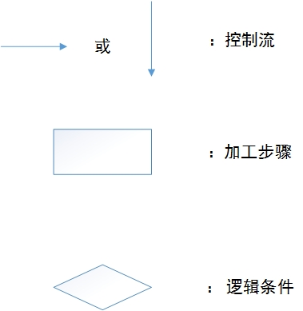

# 第四章 软件工程基础

## 4.1 软件工程基本概念

### 4.1.1 软件定义与软件特点

计算机软件是包括程序、数据及相关文档的完整集合。

软件的特点包括：

1. 软件是一种逻辑实体，而不是物理实体，具有抽象性；
2. 软件的生产与硬件不同，它没有明显的制作过程；
3. 软件在运行、使用期间不存在磨损、老化问题；
4. 软件的开发、运行对计算机系统具有依赖性，受计算机系统的限制，这导致了软件移植的问题；
5. 软件复杂性高，成本昂贵；
6. 软件开发涉及诸多的社会因素。

### 4.1.2 软件危机与软件工程

软件工程源自软件危机。==所谓软件危机是泛指在计算机软件的开发和维护过程中所遇到的一系列严重问题。==

软件工程的主要思想是将工程化原则运用到软件开发过程，它包括3个要素：==方法、工具和过程==。

1. 方法是完成软件工程项目的技术手段；
2. 工具是支持软件的开发、管理、文档生成；
3. 过程支持软件开发的各个环节的控制、管理。

### 4.1.3 软件过程软件生命周期

**软件过程**是把输入转化为输出的一组彼此相关的资源和活动。

**软件生命周期**：软件产品从==提出、实现、使用维护到停止使用退役==的过程。
软件生命周期分为软件==定义、软件开发及软件运行维护==三个阶段：

1. 软件定义阶段：包括制定计划和需求分析。
   　　**制定计划**：确定总目标；可行性研究；探讨解决方案；制定开发计划。
     **需求分析**：对待开发软件提出的需求进行分析并给出详细的定义。
2. 软件开发阶段：
   　　**软件设计**：分为概要设计和详细设计两个部分。
     **软件实现**：把软件设计转换成计算机可以接受的程序代码。
     **软件测试**：在设计测试用例的基础上检验软件的各个组成部分。
3. 软件运行维护阶段：软件投入运行，并在使用中不断地维护，进行必要的扩充和删改。

### 4.1.4 软件工程的目标与原则

1. 软件工程目标：在给定成本、进度的前提下，开发出具有有效性、可靠性、可理解性、
   可维护性、可重用性、可适应性、可移植性、可追踪性和可互操作性且满足用户需求的产品。
2. 软件工程需要达到的基本目标应是：
   1. 付出较低的开发成本；
   2. 达到要求的软件功能；
   3. 取得较好的软件性能；
   4. 开发的软件易于移植；
   5. 需要较低的维护费用；
   6. 能按时完成开发，及时交付使用。
3. 软件工程原则：==抽象、信息隐蔽、模块化、局部化、确定性、一致性、完备性和可验证性==。

## 4.2 结构化分析方法

结构化分析是结构化程序设计理论在软件需求分析阶段的运用。

### 4.2.1 需求分析与需求分析方法

**需求分析方法：**

1. 结构化需求分析方法；
2. 面向对象的分析方法。

### 4.2.2 结构化分析方法

<u>结构化分析方法的实质：着眼于数据流，自顶向下，逐层分解，建立系统的处理流程，以数据流图和数据字典为主要工具，建立系统的逻辑模型。</u>

**结构化分析的常用工具：**

1. 数据流图(data flow diagram,DFD)；

   (图片待补充 P107)

2. 数据字典(data dictionary,DD)；

3. 判定树；

4. 判定表。

## 4.3 结构化设计方法

经过需求分析，软件系统确定了“做什么”的目标，进而进入软件设计，来解决和确定“怎样做”的问题。

### 4.3.1 软件设计基本概念

**软件设计基础**：

从技术观点来看，软件设计包括：

1. 软件结构设计

2. 数据设计

3. 接口设计

4. 过程设计

   

从工程角度来看，软件设计分两步完成，即==概要设计和详细设计==。

1. 概要设计：又称结构设计，将软件需求转化为软件体系结构，确定系统级接口、全局数据结构或数据库模式。
2. 详细设计：确定每个模块的实现算法和局部数据结构，用适当方法表示算法和数据结构的细节。

**软件设计的基本原理**：

软件设计的基本原理包括：==抽象、模块化、信息隐蔽和模块独立性==。

1. 抽象。抽象是一种思维工具，就是把事物本质的共同特性提取出来而不考虑其他细节。　　
2. 模块化。解决一个复杂问题时自顶向下逐步把软件系统划分成一个个较小的、相对独立但又不相互关联的模块的过程。　
3. 信息隐蔽。每个模块的实施细节对于其他模块来说是隐蔽的。
4. 模块独立性。软件系统中每个模块只涉及软件要求的具体的子功能，而和软件系统中其他的模块的接口是简单的。

### 4.3.2 概要设计

软件概要设计的基本任务是：

1. 设计软件系统结构；
2. 数据结构及数据库设计；
3. 编写概要设计文档；
4. 概要设计文档评审。

==常用的软件结构设计工具是结构图(structure chart ,SC)，也称程序结构图。==

程序结构图的基本图符：

​	(p114)

（模块用一个矩形表示，箭头表示模块间的调用关系。在结构图中还可以用带注释的箭头表示模块调用过程中来回传递的信息。还可用带实心圆的箭头表示传递的是控制信息，空心圆箭心表示传递的是数据信息。）

### 4.3.3 详细设计

详细设计是为软件结构图中的每一个模块确定实现算法和局部数据结构，用某种选定的表达工具表示算法和数据结构的细节。
　　
常用的过程设计(即详细设计)工具有以下几种：

1. 图形工具：
     1. 程序流程图
         
     2. N-S(方盒图)
     3. PAD(problem analysis diagram ,问题分析图)
     4. HIPO(层次图+输入/处理/输出图)。
2. 表格工具：判定表。　　
3. 语言工具：PDL(procedure design language)过程设计语言；也称结构化的英语和伪码。

## 4.4 软件测试

==软件测试定义==：使用人工或自动手段来运行或测定某个系统的过程，其目的在于检验它是否满足规定的需求或是弄清预期结果与实际结果之间的差别。

==软件测试的目的==：尽可能地多发现程序中的错误，不能也不可能证明程序没有错误。软件测试的关键是设计测试用例，一个好的测试用例能找到迄今为止尚未发现的错误。

**软件测试方法：静态测试和动态测试 :**

1. 静态测试：包括代码检查、静态结构分析、代码质量度量。不实际运行软件，主要通过人工进行。
2. 动态测试：是基于计算机的测试，主要包括白盒测试方法和黑盒测试方法。

### 白盒测试

==白盒测试方法也称为结构测试或逻辑驱动测试==。它是根据软件产品的内部工作过程，检查内部成分，以确认每种内部操作符合设计规格要求。

**白盒测试主要方法有逻辑覆盖、基本路径测试等。**

**逻辑覆盖**：逻辑覆盖泛指一系列以程序内部的逻辑结构为基础的测试用例设计技术。通常程序中的逻辑表示有判断、分支、条件等几种表示方法。

1. 语句覆盖：选择足够的测试用例，使得程序中每一个语句至少都能被执行一次。
2. 路径覆盖：执行足够的测试用例，使程序中所有的可能的路径都至少经历一次。
3. 判定覆盖：使设计的测试用例保证程序中每个判断的每个取值分支(T或F)至少经历一次。
4. 条件覆盖：设计的测试用例保证程序中每个判断的每个条件的可能取值至少执行一次。
5. 判断-条件覆盖：设计足够的测试用例，使判断中每个条件的所有可能取值至少执行一次，同时每个判断的所有可能取值分支至少执行一次。

**基本路径测试**：其思想和步骤是，根据软件过程性描述中的控制流程确定程序的环路复杂性度量，用此度量定义基本路径集合，并由此导出一组测试用例，对每一条独立执行路径进行测试。

### 黑盒测试

==黑盒测试方法也称为功能测试或数据驱动测试。==黑盒测试是对软件已经实现的功能是否满足需求进行测试和验证。

黑盒测试主要诊断功能不对或遗漏、接口错误、数据结构或外部数据库访问错误、性能错误、初始化和终止条件错误。

黑盒测试不关心程序内部的逻辑，只是根据程序的功能说明来设计测试用例，主要方法有等价类划分法、边界值分析法、错误推测法等，主要用软件的确认测试。

### 软件测试策略

1. 单元测试
2. 集成测试
3. 确认测试
4. 系统测试

## 4.5 程序的调试

==程序调试的任务是诊断和改正程序中的错误==，主要在开发阶段进行，调试程序应该由编制源程序的程序员来完成。

程序调试的基本步骤：(1)错误定位；(2)纠正错误；(3)回归测试（防止引进新错误）。

**软件调试可分为静态调试和动态调试：**

1. 静态调试：主要是指通过人的思维来分析源程序代码和排错，是主要的调试手段
2. 动态调试：是辅助静态调试。

对软件主要的调试方法可以采用：

1. 强行排错法。
2. 回溯法。
3. 原因排除法。

