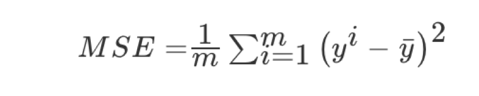

# 5. 模型评估

## 5.1 [分类模型评估](ref/机器学习（算法篇）/逻辑回归/section4.html)

- 混淆矩阵
  - 真正例（TP）
  - 伪反例（FN）
  - 伪正例（FP）
  - 真反例（TN）
- 精确率(Precision)与召回率(Recall)
  - 准确率：（对不对）
    - （TP+TN）/(TP+TN+FN+FP)
  - 精确率 -- 查的准不准
    - TP/(TP+FP)
  - 召回率 -- 查的全不全
    - TP/(TP+FN)
  - F1-score
    - 反映模型的稳健性

**API:**

- `sklearn.metrics.classification_report(y_true, y_pred, labels=[], target_names=None )`
- - y_true：真实目标值
  - y_pred：估计器预测目标值
  - labels:指定类别对应的数字
  - target_names：目标类别名称
  - return：每个类别精确率与召回率

## 5.2 回归模型评估

均方误差(Mean Squared Error)MSE)评价机制：

注：yi为预测值，y* 为真实值

**API:**

- `sklearn.metrics.mean_squared_error(y_true, y_pred)`
  - 均方误差回归损失
  - y_true:真实值
  - y_pred:预测值
  - return:浮点数结果

## 5.3 拟合

- 过拟合：一个假设**在训练数据上能够获得比其他假设更好的拟合， 但是在测试数据集上却不能很好地拟合数据**，此时认为这个假设出现了过拟合的现象。(模型过于复杂)
- 欠拟合：一个假设**在训练数据上不能获得更好的拟合，并且在测试数据集上也不能很好地拟合数据**，此时认为这个假设出现了欠拟合的现象。(模型过于简单)

---

### [正则化](../ref/机器学习（算法篇）/线性回归/section9.html)

通过限制高次项的系数进行防止过拟合。

- L1正则化
  - 理解：直接把高次项前面的系数变为0
  - Lasso回归
- L2正则化
  - 理解：把高次项前面的系数变成特别小的值
  - 岭回归

