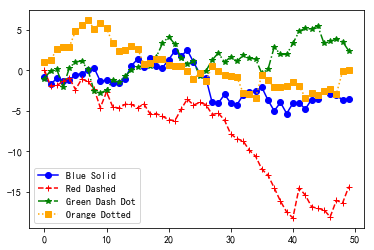

```python
from matplotlib import pyplot as plt
```


```python
x = range(0,11)
y = x**2
```


```python
# plt.grid()
# axis:控制方向
# color: 支持十六进制颜色
# linestyle: 线的形状
# alpha:透明度

plt.grid(axis='both')
plt.plot(x,y)
plt.show()
```


```python
# plt.axis([xmin,xmax,ymin,ymax]) 设置x,y轴刻度值范围
# plt.axis('off') 关闭坐标轴刻度

plt.axis([0,12,0,30])
plt.plot(x,y)
plt.show()
```


```python
# plt.legend() 设置图例 (在plot中设置label)
# loc 设置图里标签位置 (best)0-(center)10
# ncol 设置图例中有几列

plt.plot(x,y,label='x**2')
plt.legend(loc=10,ncol=1)
plt.show()
```


```python
# plt.plot(x,y,[color,alpha,linestyle,linewidth,marker,markersize])
# color或c：颜色'r'或'red'或'#ff0000'或 rgb元组 (1,0,0),值只能是0到1
# alpha：透明度
# linestyle或ls:线形
# linewidth或lw:线宽
# marker:点型
# markersize:点的大小

'''
matplotlib模块中的颜色和线条风格
作为线性图的替代，可以通过向 plot() 函数添加格式字符串来显示离散值。 可以使用以下格式化字符。

字符	描述
'-'	实线样式
'--'	短横线样式
'-.'	点划线样式
':'	虚线样式
'.'	点标记
','	像素标记
'o'	圆标记
'v'	倒三角标记
'^'	正三角标记
'&lt;'	左三角标记
'&gt;'	右三角标记
'1'	下箭头标记
'2'	上箭头标记
'3'	左箭头标记
'4'	右箭头标记
's'	正方形标记
'p'	五边形标记
'*'	星形标记
'h'	六边形标记 1
'H'	六边形标记 2
'+'	加号标记
'x'	X 标记
'D'	菱形标记
'd'	窄菱形标记
'&#124;'	竖直线标记
'_'	水平线标记
以下是颜色的缩写：

字符	颜色
'b'	蓝色
'g'	绿色
'r'	红色
'c'	青色
'm'	品红色
'y'	黄色
'k'	黑色
'w'	白色
'''
```


```python
# plt.subplot(3,2,4) :  分成3行2列，共6个绘图区域，在第4个区域绘图。排序为行优先。也可 plt.subplot(324)，将逗号省略
#subplot可以规划figure划分为n个子图，但每条subplot命令只会创建一个子图 

#作图1
plt.subplot(221)  
plt.plot(x, y)  
#作图2
plt.subplot(224)  
plt.plot(x, y)  
plt.show()
```


```python
#subplots创建多个子图

fig,axes=plt.subplots(2,2)
ax1=axes[0,0]
ax2=axes[0,1]
ax3=axes[1,0]
ax4=axes[1,1]

ax2.plot(x,y)
ax3.plot(x,y)
plt.show()
```


# figure语法及操作

figure(num=None, figsize=None, dpi=None, facecolor=None, edgecolor=None, frameon=True)

num:图像编号或名称，数字为编号 ，字符串为名称
figsize:指定figure的宽和高，单位为英寸；
dpi参数指定绘图对象的分辨率，即每英寸多少个像素，缺省值为80      1英寸等于2.5cm,A4纸是 21*30cm的纸张 
facecolor:背景颜色
edgecolor:边框颜色
frameon:是否显示边框


```python
#面向对象API：add_subplots与add_axes新增子图或区域
#add_subplot与add_axes都是面对象figure编程的，pyplot api中没有此命令

#add_subplot的参数与subplots的相似
fig=plt.figure(figsize=(4,3),facecolor='skyblue')
ax1=fig.add_subplot(2,2,1)
ax1.plot(x,y)

ax3=fig.add_subplot(2,2,4)
ax3.grid(color='r', linestyle='--', linewidth=1,alpha=0.3)
ax3.plot(x,y)
plt.show()
```


# Plot的图表函数

plt.plot(x,y , fmt)  ：绘制坐标图

plt.boxplot(data, notch, position): 绘制箱形图

plt.bar(left, height, width, bottom) : 绘制条形图

plt.barh(width, bottom, left, height) : 绘制横向条形图

plt.polar(theta, r) : 绘制极坐标图

plt.pie(data, explode) : 绘制饼图

plt.scatter(x, y) :绘制散点图

plt.hist(x, bings, normed) : 绘制直方图

# Examples


```python
import numpy as np
from matplotlib import pyplot as plt

x = np.arange(1,11)
y=  2 * x + 5
plt.title("Matplotlib demo")
plt.xlabel("x axis caption")
plt.ylabel("y axis caption")
plt.plot(x,y)
plt.show()
```


```python
import numpy as np
import pandas as pd
import matplotlib.pyplot as plt
from pandas import Series,DataFrame

x=np.linspace(0,2*np.pi,100) #在指定的间隔内返回均匀间隔的数字
y=np.sin(x)
plt.plot(x,y,'b*',label='a')
plt.plot(x*2,y,'r--',label='b')
plt.legend() #显示图例
plt.show()
```


```python
# 4-25 显示条形图

import matplotlib.pyplot as plt

plt.rcParams['font.sans-serif']=['SimHei']
plt.rcParams['axes.unicode_minus']=False
month=['January','February','March','April','May']
sale_amounts=[27,90,20,111,23]
month_index=range(len(month))
fig=plt.figure()
axl = fig.add_subplot(1,1,1)
axl.bar(month_index,sale_amounts,align='center',color='darkblue')
axl.xaxis.set_ticks_position('bottom') # 设置坐标轴上的数字显示的位置，top:显示在顶部  bottom:显示在底部,默认是none
axl.yaxis.set_ticks_position('left')
plt.xticks(month_index,month,rotation=0,fontsize='small')
#[0,1]代表x坐标轴的0和1位置，[2,3]代表0,1位置的显示lable，rotation代表lable显示的旋转角度
plt.xlabel('月份')
plt.ylabel('销售额')
plt.title('每个月的销售额')
plt.show()
```


```python
# 4-26 散点图

from numpy.random import randn
import matplotlib.pyplot as plt

plt.rcParams['font.sans-serif']=['SimHei']
plt.rcParams['axes.unicode_minus']=False
plot_data1 = randn(50).cumsum()
plot_data2 = randn(50).cumsum()
plot_data3 = randn(50).cumsum()
plot_data4 = randn(50).cumsum()
fig=plt.figure()
axl=fig.add_subplot(1,1,1)
axl.plot(plot_data1,marker=r'o',color=u'blue',linestyle='-',label='Blue Solid')
axl.plot(plot_data2,marker=r'+',color=u'red',linestyle='--',label='Red Dashed')
axl.plot(plot_data3,marker=r'*',color=u'green',linestyle='-.',label='Green Dash Dot')
axl.plot(plot_data4,marker=r's',color=u'orange',linestyle=':',label='Orange Dotted')
axl.xaxis.set_ticks_position('bottom')
axl.yaxis.set_ticks_position('left')
plt.legend(loc='best')
plt.show()
```




